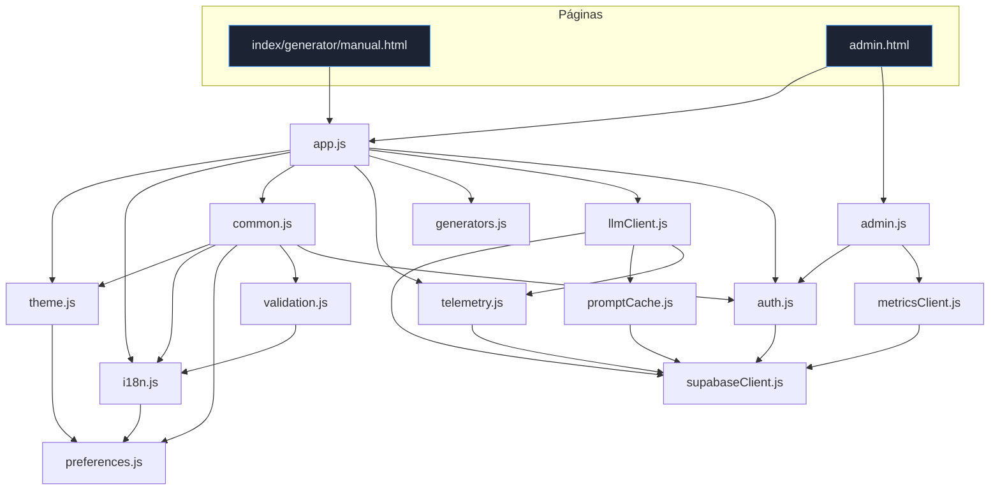

# Arquitetura & Interligação dos Scripts

Como os scripts se conectam. Referência função-a-função em
[`SCRIPTS.md`](./SCRIPTS.md); explicação ligada ao código em
[`EXPLICACAO-CODIGO.md`](./EXPLICACAO-CODIGO.md).

> Base dos links: `https://github.com/danzeroum/prompte/blob/main/`

## 1. Grafo de dependências (frontend)

Setas = `import`. [`app.js`](https://github.com/danzeroum/prompte/blob/main/frontend/assets/js/app.js)
é o entry de todas as páginas; [`admin.js`](https://github.com/danzeroum/prompte/blob/main/frontend/assets/js/admin.js)
é o entry adicional do dashboard. [`supabaseClient.js`](https://github.com/danzeroum/prompte/blob/main/frontend/assets/js/supabaseClient.js)
é o **hub** de todo acesso ao backend.



**Camadas:**
- **Entrypoints:** [`app.js`](https://github.com/danzeroum/prompte/blob/main/frontend/assets/js/app.js#L53), [`admin.js`](https://github.com/danzeroum/prompte/blob/main/frontend/assets/js/admin.js#L43).
- **UI/UX:** [`common.js`](https://github.com/danzeroum/prompte/blob/main/frontend/assets/js/common.js), [`theme.js`](https://github.com/danzeroum/prompte/blob/main/frontend/assets/js/theme.js), [`i18n.js`](https://github.com/danzeroum/prompte/blob/main/frontend/assets/js/i18n.js), [`validation.js`](https://github.com/danzeroum/prompte/blob/main/frontend/assets/js/validation.js), [`preferences.js`](https://github.com/danzeroum/prompte/blob/main/frontend/assets/js/preferences.js).
- **Backend client:** [`supabaseClient.js`](https://github.com/danzeroum/prompte/blob/main/frontend/assets/js/supabaseClient.js) ← [`telemetry`](https://github.com/danzeroum/prompte/blob/main/frontend/assets/js/telemetry.js), [`promptCache`](https://github.com/danzeroum/prompte/blob/main/frontend/assets/js/promptCache.js), [`llmClient`](https://github.com/danzeroum/prompte/blob/main/frontend/assets/js/llmClient.js), [`auth`](https://github.com/danzeroum/prompte/blob/main/frontend/assets/js/auth.js), [`metricsClient`](https://github.com/danzeroum/prompte/blob/main/frontend/assets/js/metricsClient.js).

## 2. Frontend ↔ Backend ↔ Banco

```mermaid
graph LR
  LLM[llmClient.askLLM]:::f --> EF1[Edge: prompt-llm]:::e
  METC[metricsClient.fetchMetrics]:::f --> EF2[Edge: metrics]:::e
  TEL[telemetry.flush]:::f -->|insert| T1[(events)]:::d
  EF1 -->|select/upsert| T2[(prompt_cache)]:::d
  EF1 -->|rpc| FN1[[consume_rate_limit]]:::d
  FN1 --> T3[(rate_limit_hits)]:::d
  EF1 -->|fetch| DS[DeepSeek / OpenAI]:::x
  EF2 -->|rpc| FN2[[get_metrics]]:::d
  FN2 --> T1
  classDef f fill:#143; classDef e fill:#234; classDef d fill:#412; classDef x fill:#330;
```

- `llmClient.askLLM` → Edge `prompt-llm`: [chamada](https://github.com/danzeroum/prompte/blob/main/frontend/assets/js/llmClient.js#L33) / [handler](https://github.com/danzeroum/prompte/blob/main/supabase/functions/prompt-llm/index.ts#L123).
- `metricsClient.fetchMetrics` → Edge `metrics`: [chamada](https://github.com/danzeroum/prompte/blob/main/frontend/assets/js/metricsClient.js#L4) / [handler](https://github.com/danzeroum/prompte/blob/main/supabase/functions/metrics/index.ts#L32).
- `telemetry.flush` → `events`: [insert](https://github.com/danzeroum/prompte/blob/main/frontend/assets/js/telemetry.js#L82).

## 3. Fluxo de uma requisição de prompt (passo a passo, com código)

1. Página chama `window.PE.askLLM(...)` — exposto em [`app.js:70`](https://github.com/danzeroum/prompte/blob/main/frontend/assets/js/app.js#L70).
2. [`askLLM`](https://github.com/danzeroum/prompte/blob/main/frontend/assets/js/llmClient.js#L33) calcula o hash e tenta o cache local via [`getCachedResponse`](https://github.com/danzeroum/prompte/blob/main/frontend/assets/js/promptCache.js#L30). **Hit →** retorna e registra [`track('llm_request', {cache_hit:true})`](https://github.com/danzeroum/prompte/blob/main/frontend/assets/js/telemetry.js#L36).
3. **Miss →** `functions.invoke('prompt-llm', { headers: { 'x-request-id' } })`.
4. Edge [`Deno.serve`](https://github.com/danzeroum/prompte/blob/main/supabase/functions/prompt-llm/index.ts#L123): recalcula o hash ([mesmo `stableStringify`/`sha256Hex`](https://github.com/danzeroum/prompte/blob/main/supabase/functions/prompt-llm/index.ts#L51)) e consulta [`prompt_cache`](https://github.com/danzeroum/prompte/blob/main/supabase/functions/prompt-llm/index.ts#L152).
5. Miss → [`consume_rate_limit`](https://github.com/danzeroum/prompte/blob/main/supabase/functions/prompt-llm/index.ts#L173). Excedeu → **429**.
6. Dentro do limite → [`callLLM`](https://github.com/danzeroum/prompte/blob/main/supabase/functions/prompt-llm/index.ts#L83) (DeepSeek→OpenAI) → [upsert no cache](https://github.com/danzeroum/prompte/blob/main/supabase/functions/prompt-llm/index.ts#L199) → resposta com `Cache-Control`.
7. De volta no cliente, [`askLLM`](https://github.com/danzeroum/prompte/blob/main/frontend/assets/js/llmClient.js#L33) registra a telemetria (incl. `429` via [`buildLlmEvent`](https://github.com/danzeroum/prompte/blob/main/frontend/assets/js/llmClient.js#L12)).

> **Contrato crítico:** o hash do cliente ([`promptCache`](https://github.com/danzeroum/prompte/blob/main/frontend/assets/js/promptCache.js#L11)) e o da Edge ([prompt-llm](https://github.com/danzeroum/prompte/blob/main/supabase/functions/prompt-llm/index.ts#L51)) **devem coincidir** — mesmo `stableStringify` + sha256.

## 4. Fluxo de boot (todas as páginas)

[`init()`](https://github.com/danzeroum/prompte/blob/main/frontend/assets/js/app.js#L53) →
[`initTheme`](https://github.com/danzeroum/prompte/blob/main/frontend/assets/js/theme.js#L38) ·
[`initI18n`](https://github.com/danzeroum/prompte/blob/main/frontend/assets/js/i18n.js#L114) ·
[`enhanceNavigation`](https://github.com/danzeroum/prompte/blob/main/frontend/assets/js/common.js#L21) ·
[`injectTopbarControls`](https://github.com/danzeroum/prompte/blob/main/frontend/assets/js/common.js#L80) ·
[`initAuth`](https://github.com/danzeroum/prompte/blob/main/frontend/assets/js/auth.js#L61) ·
[`mountManualPlayground`](https://github.com/danzeroum/prompte/blob/main/frontend/assets/js/app.js#L13) ·
[`track('pageview')`](https://github.com/danzeroum/prompte/blob/main/frontend/assets/js/telemetry.js#L36) + agenda `flush`.

## 5. Fluxo de autenticação e dashboard

1. Modal de login ([`buildAuthModal`](https://github.com/danzeroum/prompte/blob/main/frontend/assets/js/common.js#L256)) → [`signInWithEmail`](https://github.com/danzeroum/prompte/blob/main/frontend/assets/js/auth.js#L41) (magic link).
2. No retorno, [`initAuth`](https://github.com/danzeroum/prompte/blob/main/frontend/assets/js/auth.js#L61) detecta a sessão e notifica via [`onAuthChange`](https://github.com/danzeroum/prompte/blob/main/frontend/assets/js/auth.js#L20).
3. O JWT autenticado passa a ser anexado às chamadas → a Edge concede o limite maior ([decodeJwt](https://github.com/danzeroum/prompte/blob/main/supabase/functions/prompt-llm/index.ts#L67)).
4. No dashboard, [`admin.js:mount`](https://github.com/danzeroum/prompte/blob/main/frontend/assets/js/admin.js#L43) reage ao login e chama [`fetchMetrics`](https://github.com/danzeroum/prompte/blob/main/frontend/assets/js/metricsClient.js#L4) → Edge `metrics` valida `ADMIN_EMAILS` ([handler](https://github.com/danzeroum/prompte/blob/main/supabase/functions/metrics/index.ts#L32)).
